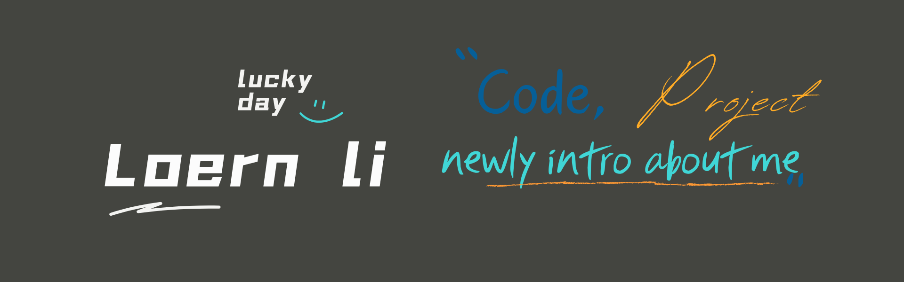

<h2>
 
<b style="font-size:25px">Merheba û bi xêr hatî 🙏🏻,I'am Andy Li ! </b>

</h2>

### Senior Architect at **Loern**

## Hi there 👋

[](https://twitter.com/loern)
[](https://github.com/codeducker)
[](https://codepen.io/codeducker)
[](https://loern.dev)
[](https://www.youtube.com/@codeducker-hz2jn)
[](https://space.bilibili.com/346338565)
[](https%3A%2F%2Fjuejin.cn%2Fuser%2F3808364009363997)


<em><b style="font-size:20px"> a little more about me !<b> </em> 

```rust
    let loern = json::parse(r#"
    {
    "code": ["java","python","c#","go","groovy","lua","shell","php","c"],
    "learningCode":["c++","rust","kotlin","swift","object-c","android"],
    "askMeAbout": ["Backend Development","Framework","Server","Web Development","Distributed Server","Shell Script"],
    "technologies":{
        "backend": {
            "netty","spring","hibernate","mybatis","nacos","spring cloud","Rxava"
        },
        "forefront":[
            "html","css","javascript","jquery","vue","bootstrap"
        ],
        "devOps":{
            "jenkins","docker","aliyun","kubernetes","nginx","server"
        },
        "database":{
            "mysql","sqlserver","postgresql","mongodb"
        },
        "cache":[
            "redis","memcache"
        ]
        "misc":{

        },
        "currentFocus":[
            "leetcode",
            "c++","rust","AIGC","machine learning","artificial intelligence"
        ],
        funFact: "There are two ways to write error-free programs; only the third one works"
    }
}"#).unwrap();
```
<div>

<hr>

### Statistics


### 


</div>


<hr>

### Popular Repository


[](https://github.com/codeducker/leetcode)